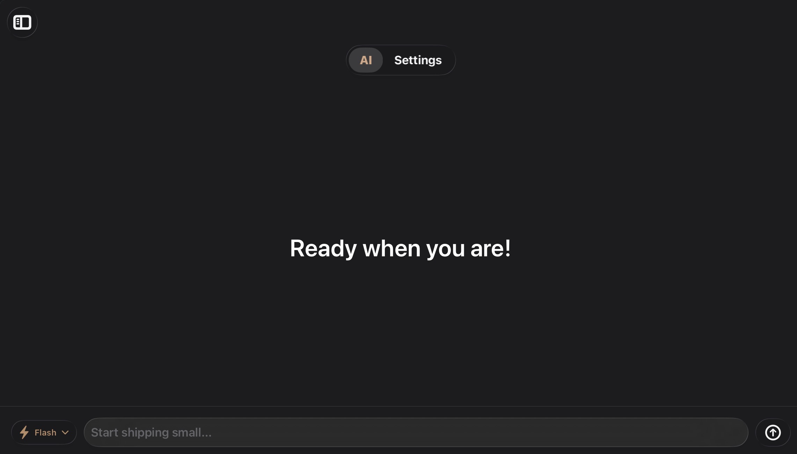
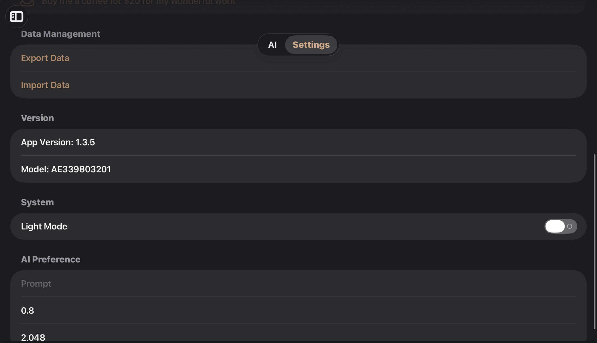

<div align="center">


# PersistenceAI

### Native AI Assistant for Apple Platforms

*A modern AI assistant built entirely with SwiftUI for **iPhone**, **iPad**, and **macOS**.*


[Features](#-features) •
[Installation](#-installation) •
[Screenshots](#-screenshots) •
[Requirements](#-requirements) •
[Roadmap](#-roadmap)

</div>

---

# ✨ Overview

PersistenceAI is a modern AI assistant developed entirely with **SwiftUI**, delivering a native Apple experience across **iPhone**, **iPad**, and **macOS**.

The application focuses on simplicity, performance, and a clean user experience while providing powerful AI conversations, customizable settings, image support, and modern interface components.

Built using Apple's latest technologies, PersistenceAI embraces the newest design language with **Glass UI**, smooth animations, adaptive layouts, and a modular architecture that is easy to maintain and extend.

Whether you're asking questions, generating code, brainstorming ideas, or having everyday conversations, PersistenceAI aims to provide a polished and enjoyable experience.

---

# 🚀 Features

## 💬 AI Chat

* Modern SwiftUI chat interface
* Native Apple design
* Streaming AI responses
* Markdown rendering
* Syntax-highlighted code blocks
* Thinking indicator
* Conversation history
* Sidebar navigation
* Smooth animations
* Responsive layouts

---

## ✨ Glass UI

PersistenceAI already features beautiful **Glass UI** inspired by Apple's latest design language.

Included throughout the application:

* Native Glass Effects
* Glass Cards
* Glass Navigation
* Modern translucent interface
* Smooth blur materials
* Elegant animations
* SwiftUI implementation

---

## 🤖 AI Customization

Configure the AI to match your workflow.

Features include:

* AI Model Selection
* System Prompt
* Temperature Adjustment
* Maximum Tokens
* Conversation Preferences

---

## 🖼 Image Support

PersistenceAI includes support for working with images.

Current capabilities include:

* Import images
* Photo Library integration
* Image attachments
* Native PhotosUI support

---

## 💾 Data Management

Keep your conversations safe.

* Import chats
* Export chats
* Preserve conversations
* Save preferences
* Restore previous sessions

---

## 🎨 Beautiful Interface

Designed from the ground up using **SwiftUI**.

Highlights include:

* Native SwiftUI Views
* Adaptive Layout
* Sidebar Navigation
* Modern Navigation Stack
* Glass UI
* Responsive Design
* Optimized Performance

---

# 📷 Screenshots

## Home



The Home screen provides a clean and distraction-free AI chat experience with a modern SwiftUI interface, beautiful Glass UI, and responsive navigation.

---

## Settings



The Settings screen allows you to customize AI behavior, configure model preferences, adjust application settings, and personalize your PersistenceAI experience.


---

## Settings


The Settings page allows you to configure AI preferences, personalize your experience, and manage application settings.

---

# 📦 Installation

Clone the repository.

```bash
git clone https://github.com/NickFire101/PersistenceAI-iOS.git
```

Open the project using the latest version of **Xcode**.

Build and run the application on an iPhone, iPad, or macOS device.

---

# ⚙ Requirements

| Component | Version       |
| --------- | ------------- |
| iOS       | 26.0 or later |
| macOS     | 26.0 or later |
| Swift     | 5.9 or later  |
| Xcode     | Latest        |
| SwiftUI   | Required      |

---

# 📱 Supported Platforms

| Platform      | Support |
| ------------- | ------- |
| 📱 iPhone     | ✅       |
| 📱 iPad       | ✅       |
| 💻 macOS      | ✅       |
| ⌚ Apple Watch | ❌       |
| 📺 Apple TV   | ❌       |

---

# ❤️ Why PersistenceAI?

PersistenceAI is designed to feel like a true native Apple application.

Instead of relying on heavy frameworks or complex interfaces, the project embraces SwiftUI and Apple's latest technologies to create an experience that is:

* Fast
* Lightweight
* Beautiful
* Native
* Modern
* Customizable
* Easy to use
* Ready for future expansion

---

# 🏗 Project Structure

```text
PersistenceAI
│
├── App
│   ├── Application Entry
│   └── App Configuration
│
├── Chat
│   ├── Chat Messages
│   ├── Conversation Models
│   └── Message Management
│
├── Models
│   ├── AI Models
│   ├── API Models
│   ├── Message Models
│   └── Application Models
│
├── Photos_Files
│   ├── Image Attachments
│   ├── Photo Picker
│   └── Image Processing
│
├── Service
│   ├── AI Provider
│   ├── Network Services
│   └── API Communication
│
├── State
│   ├── App State
│   ├── Chat State
│   └── User Preferences
│
├── Tabs
│   ├── Home
│   ├── Chat
│   └── Settings
│
├── Think
│   ├── Thinking Indicator
│   └── Response Components
│
└── View
    ├── Main Views
    ├── Message Views
    ├── Sidebar
    └── Shared Components
```

---

# 🏛 Architecture

PersistenceAI follows a modular SwiftUI architecture to keep the application clean, maintainable, and scalable.

```text
           SwiftUI Views
                 │
                 ▼
          Application State
                 │
                 ▼
           Service Layer
                 │
                 ▼
            AI Providers
                 │
                 ▼
             AI Responses
```

Each layer has a dedicated responsibility, making the project easier to understand, maintain, and extend.

---

# 🛠 Built With

PersistenceAI is built using modern Apple technologies.

* Swift
* SwiftUI
* Foundation
* Combine
* UIKit
* PhotosUI
* UniformTypeIdentifiers

---

# 📦 Dependencies

Current packages used by the project include:

* HighlightSwift

Additional dependencies may be added in future releases as new functionality is introduced.

---

# 🚀 Usage

After launching the application:

1. Open PersistenceAI.
2. Choose your preferred AI model.
3. Configure the AI settings if desired.
4. Start a new conversation.
5. Attach images when needed.
6. Import or export conversations from the Settings page.

PersistenceAI is designed to provide a smooth and responsive AI experience while keeping the interface intuitive and easy to navigate.

---

# ⚙ AI Configuration

PersistenceAI allows you to personalize how the AI behaves.

Available settings include:

* AI Model Selection
* System Prompt
* Temperature
* Maximum Tokens

These options allow the assistant to better suit different workflows, from casual conversations to coding assistance.

---

# 🎨 Design Philosophy

PersistenceAI follows Apple's Human Interface Guidelines while embracing modern SwiftUI development.

Core principles include:

* Native-first experience
* Beautiful Glass UI
* Responsive performance
* Simple navigation
* Minimalistic design
* Adaptive layouts
* Accessibility-focused interface

---

# 🔒 Privacy

PersistenceAI is designed with user privacy in mind.

* Conversations remain under your control.
* Imported and exported data is managed by the user.
* Only the permissions required for app functionality are requested.

---

# 📈 Roadmap

Future updates may include:

* Additional AI providers
* More AI models
* Enhanced image understanding
* Rich document support
* Conversation search
* Improved customization
* Better performance
* More personalization options
* Additional accessibility improvements
* Continuous UI refinements

---

# 🤝 Contributing

Contributions are always welcome!

If you'd like to help improve PersistenceAI:

1. Fork the repository.
2. Create a new feature branch.
3. Commit your changes.
4. Push your branch.
5. Open a Pull Request.

Please ensure that all contributions follow the project's coding style and include appropriate documentation where necessary.

---

# ☕

# Support Development

If PersistenceAI has helped you, consider supporting its development.

<a href="https://buymeacoffee.com/NickFire101">

</a>

Every contribution helps support ongoing development, bug fixes, new features, and future improvements.

If you enjoy the project, you can also help by:

* ⭐ Starring the repository
* 🍴 Forking the project
* 🐛 Reporting bugs
* 💡 Suggesting new features
* 🤝 Contributing code

---

# 📄 License

This project is licensed under the **Apache License 2.0**.

You are free to use, modify, and distribute this software in accordance with the terms of the license.

For more information, see the **LICENSE** file included in this repository.

---

# 🙏 Acknowledgements

Special thanks to:

* Apple for Swift and SwiftUI
* The Swift open-source community
* Contributors and testers
* Everyone who supports the project

---

# 👨‍💻 Author

**NickFire101**

UI/UX Designer • App Developer • AI Engineer

---

<div align="center">

## PersistenceAI

**Native. Modern. Intelligent.**

Built with ❤️ using SwiftUI.

© 2026 NickFire101. All rights reserved.

If you like this project, don't forget to ⭐ star the repository!

</div>

