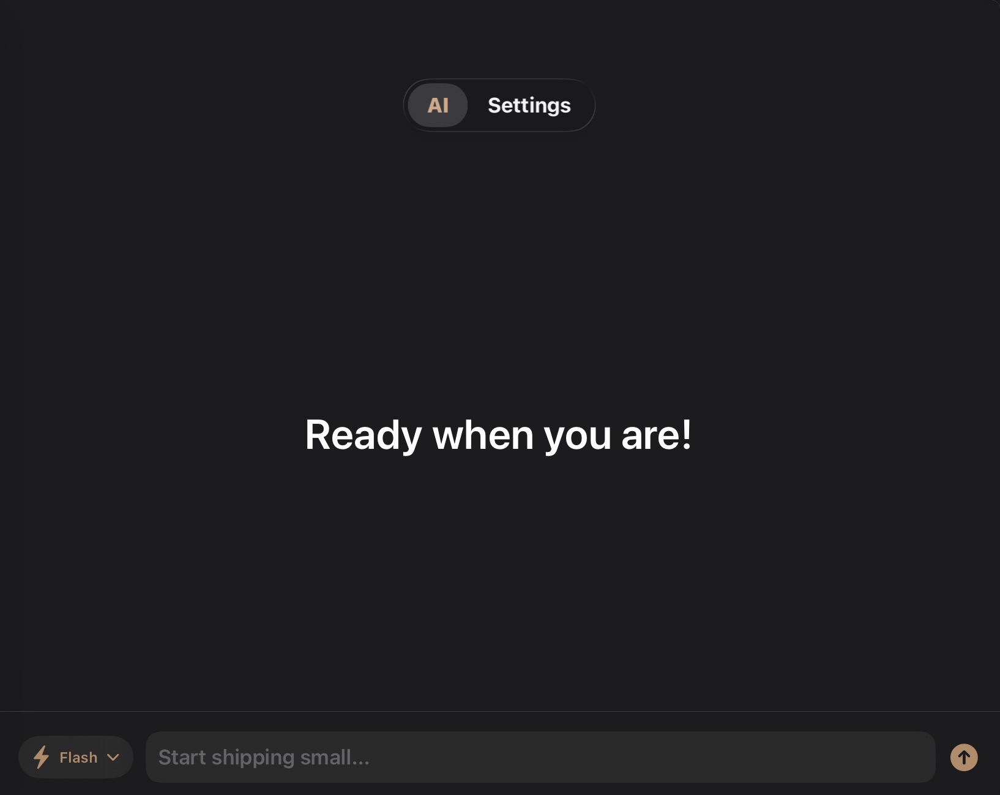
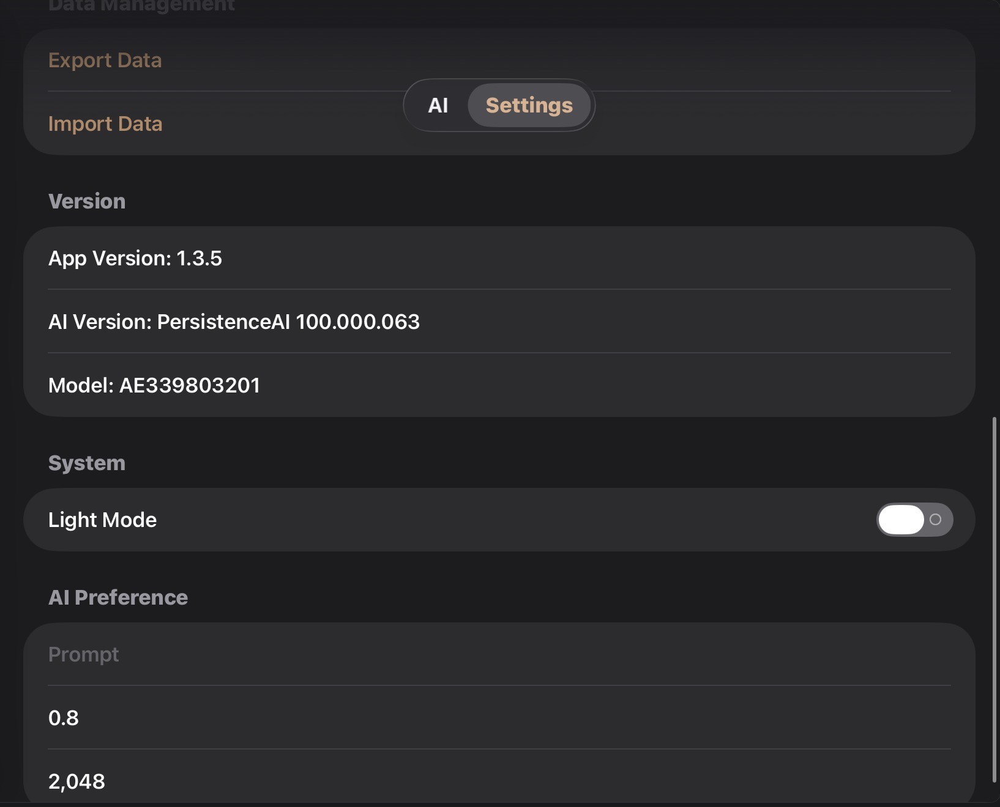

# 

# PersistenceAI

**PersistenceAI** is a modern AI assistant for Apple platforms built entirely with **SwiftUI**. It is designed to be fast, lightweight, elegant, and privacy-focused while delivering a beautiful native Apple experience.

Inspired by the newest Apple design language, PersistenceAI combines powerful AI conversations with a clean interface that feels right at home on iOS.

---

# ✨ Features

## 🤖 Intelligent AI Assistant

* Natural conversations
* Context-aware responses
* Fast message generation
* Markdown rendering
* Code highlighting
* Long conversation support
* Streaming responses
* Modern chat interface

---

## 🌤️ Weather Intelligence

PersistenceAI can understand weather-related questions and provide weather information including:

* Current temperature
* Weather conditions
* Humidity
* Wind speed
* Sunrise
* Sunset
* Feels like temperature
* Rain chance
* Daily forecasts

Example:

> "What's the weather today?"

---

## 📱 Native Apple Experience

Built using native Swift technologies.

* SwiftUI
* Observation
* Async/Await
* URLSession
* Modern Navigation
* SF Symbols
* Glass Effects (iOS 26)
* Smooth animations

No unnecessary complexity.

---

## 💬 Beautiful Chat Interface

Designed with readability in mind.

Features include:

* User & AI bubbles
* Auto scrolling
* Markdown support
* Code blocks
* Copy messages
* Typing indicator
* Animated responses
* Native gestures

---

## ⚡ Fast Performance

PersistenceAI focuses on performance.

* Lightweight architecture
* Native rendering
* Efficient networking
* Optimized updates
* Low memory usage

---

## 🎨 Modern UI

The interface follows Apple's newest design language.

Features include:

* Glass Effects
* Blur materials
* Rounded cards
* Smooth transitions
* Dynamic colors
* Dark Mode
* Light Mode
* Responsive layouts

---

# 📸 Screenshots

## Chat



---

## Settings



---

# 🏗️ Project Structure

```text
PersistenceAI/

├── App/
├── Models/
├── Views/
├── ViewModels/
├── Services/
├── Networking/
├── Weather/
├── Utilities/
├── Assets.xcassets/
├── PersistenceAIApp.swift
└── README.md
```

---

# 🚀 Getting Started

## Requirements

* macOS
* Xcode 26 or newer
* iOS 26 SDK
* Swift 6+

---

## Clone

```bash
git clone https://github.com/USERNAME/PersistenceAI.git
```

---

## Open

```bash
open PersistenceAI.xcodeproj
```

---

## Run

Choose your simulator.

Press

```
⌘ + R
```

Enjoy.

---

# ⚙️ Technologies

* Swift
* SwiftUI
* Observation
* Foundation
* URLSession
* Markdown
* Async/Await

---

# 📖 Example Conversation

**You**

```
What's the weather today?
```

**PersistenceAI**

```
Today is mostly sunny with a temperature of 31°C.
Humidity is 63% with light winds.
```

---

**You**

```
Explain SwiftUI animations.
```

**PersistenceAI**

```
SwiftUI animations allow your views to smoothly transition between state changes using built-in animation APIs.
```

---

# 🎯 Goals

PersistenceAI aims to provide:

* Beautiful design
* Excellent performance
* Native experience
* Reliable AI
* Useful utilities
* Easy maintenance

---

# 🧩 Architecture

PersistenceAI follows a clean architecture.

```text
View

↓

ViewModel

↓

Service

↓

Networking

↓

AI Provider
```

Benefits:

* Easy to maintain
* Testable
* Reusable
* Modular
* Scalable

---

# 🌍 Supported Platforms

* iPhone
* iPad
* Mac (future)
* Vision Pro (future)

---

# 🔒 Privacy

Privacy comes first.

PersistenceAI does not sell your personal information.

Depending on your chosen AI provider, messages may be securely transmitted for generating responses.

Always review the privacy policy of your selected AI service.

---

# 🛣️ Roadmap

### Planned

* Better streaming
* Multiple AI providers
* Conversation search
* Voice input
* Voice output
* Image generation
* File analysis
* PDF support
* Camera support
* Widget support
* Shortcuts integration
* Apple Intelligence enhancements
* Vision Pro support
* macOS version

---

# 🤝 Contributing

Contributions are always welcome.

You can help by:

* Fixing bugs
* Improving documentation
* Suggesting features
* Creating pull requests
* Improving performance

Please keep code clean, readable, and well documented.

---

# 🐛 Reporting Bugs

If you discover a bug, please include:

* Device model
* iOS version
* Steps to reproduce
* Expected result
* Actual result
* Screenshots (if possible)

---

# ⭐ Support

If you enjoy PersistenceAI, consider supporting the project by:

* Starring the repository
* Sharing the project
* Reporting issues
* Suggesting improvements

---

# 📄 License

This project is licensed under the MIT License.

See the LICENSE file for details.

---

# 👨‍💻 Author

Developed with ❤️ by **OneCloud Developers**.

---

# 🌟 PersistenceAI

Fast.

Beautiful.

Native.

Intelligent.

Built for the Apple ecosystem.
